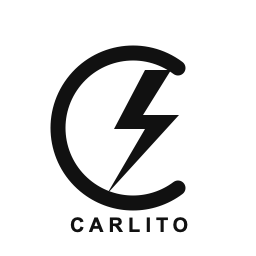

# Carlito



**Quick answers, written quietly.** A minimal handwritten Gemini assistant for
the **reMarkable Paper Pro Move**, derived from [Riddle](https://github.com/MaximeRivest/riddle).

Write a question and rest your pen. Carlito absorbs your ink and writes an
answer back. Long answers turn pages like a book; simple line diagrams can
appear between paragraphs.

## Download and install — no coding required

Get `carlito-paper-pro-move.zip` from [Releases](https://github.com/jrucho/Carlito/releases).
The bundle includes the compiled application, its display library, icon and settings.
You need developer mode, SSH access, and xovi/AppLoad already installed on your Move.

1. Unzip the download. It contains a `carlito` folder.
2. Copy that folder to your Move (USB address normally `10.11.99.1`):

   ```sh
   scp -O -r carlito root@10.11.99.1:/home/root/xovi/exthome/appload/
   ```

3. In AppLoad, tap **Reload**, configure Carlito's Gemini API key through Settings,
   then launch **Carlito**. Alternatively, copy `carlito.env.example` to
   `carlito.env` in the app folder and enter your own key from Google AI Studio.

If updating an existing installation, close Carlito first. Keep your existing
`carlito.env`; the release never includes or overwrites it.

## Fast handwritten answers

Carlito uses Gemini Flash-Lite for direct answers, with the fast configuration
preferred from Carlito 2. Response time depends on your connection, Gemini's
load, and the length of the answer. It answers from the model's knowledge;
current details are not independently verified.

## Controls

| Gesture | Action |
| --- | --- |
| Write, then rest the pen | Ask a question |
| Flip the marker | Erase |
| Tap left / right | Previous / next answer page |
| Two-finger swipe down | Clear the session and start a new chat |
| Five fingers at once | Exit to the reMarkable interface |
| One large `?` | Show the guide |
| Power button (where detected) | Sleep and restore the page |

Recent assistant replies (up to eight) provide lightweight follow-up context
in memory. This is not a complete user-question transcript. Exiting or starting
a new chat clears it. Drawings are simple model-generated line sketches, not
photorealistic images or guaranteed-accurate mathematical plotting.

## Online and offline settings

- `auto` (default): Gemini first, optional local vision server as fallback.
- `online`: Gemini only.
- `offline`: configured local OpenAI-compatible vision server only.

Offline question answering requires a local vision server on the tablet or LAN;
there is no bundled on-device language model. Keys are configured on the tablet
and are excluded from this repository and releases.

## Compatibility and building

This release targets **Paper Pro Move / aarch64**, based on the original Move
installation on OS 3.26. It is **not an RM2 release**; the attempted RM2 port
did not pass writing/exit checks and is not offered here.

For source builds, see [BUILD.md](BUILD.md). Reinstalling a downloaded release
requires file transfer and configuration, not coding or compiling.

## Credits and license

Based on Maxime Rivest's Riddle; original MIT attribution is retained in LICENSE.
Dancing Script is licensed under SIL OFL (see `app/fonts/OFL.txt`).
Carlito's code is MIT. Proprietary reMarkable `libqsgepaper.so` and Qt libraries
are not distributed; the application uses those supplied by your own device.
